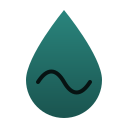

<p align="center">
  
</p>

<h1 align="center">Ω∞v Oceanicos</h1>

<p align="center"><strong>One root. One current. Infinite forms.</strong></p>

<p align="center">
  <a href="docs/spec/ATTESTATION-ENVELOPE.md">Attestation envelope</a> ·
  <a href="docs/BRAND.md">Brand</a> ·
  <a href="SECURITY.md">Security</a> ·
  <a href="apps/api/README.md">API</a> ·
  <a href="docs/decisions/0001-single-origin-deployment.md">Decisions</a>
</p>

[](https://github.com/starofgodmayomi-droid/omega-v-oceanicos/actions/workflows/verify.yml)
[](LICENSE)

> **Attest, don't assert. Evidence before trust. Verification before evolution.**

A verification-first full-stack ecosystem for observing, verifying, attesting, and continuously evolving trustworthy intelligence systems.

## Quick Links

- 📋 **[Manifest](MANIFEST.md)** — Project mission, principles, and architecture
- 📜 **[Charter](CHARTER.md)** — Living agnostic principles and decision-making
- 🤝 **[Contributing](CONTRIBUTING.md)** — How to contribute verification-first
- 📖 **[Documentation](docs/)** — Architecture, guides, and references
- ⚙️ **[Development Setup](docs/DEVELOPMENT.md)** — Get the project running locally

---

## What Is Ω∞v?

Ω∞v Oceanicos is a system for building trustworthy software through continuous verification and evidence-based evolution.

### Growth law

```text
0 → MINI → + → + → FULL STACK → ECOSYSTEM → REALITY ↺ ∞
```

Architecture does **not** begin as the giant ecosystem. It begins at **ZERO**, becomes **MINI**, and expands only when reality verifies the next step.

### The MINI Kernel

```text
💧 Ω∞v MINI ::= 👁 Observe → ✓ Verify → 🧠 Remember
```

Every MINI cycle:

1. **Observed** with metadata (who, when, what, confidence)
2. **Verified** against rules with evidence paths
3. **Remembered** in append-only, hash-chained memory

### Expanded loop (earned layers)

```
Observe → Verify → Remember → Attest → Display → Learn → Return
```

Attestation, APIs, UI, and infra are **earned expansions** — not prerequisites. See [docs/MINI.md](docs/MINI.md).

### Why It Matters

Most systems assert correctness. We verify it.

- **Without verification**: "The system is healthy" (hope-based)
- **With verification**: "The system returned 200ms responses for 1000 consecutive requests; verified by rules v1.2.0; signed at 2026-08-07T10:30:02Z" (evidence-based)

---

## Key Principles

### 1. Verification Before Everything

No claim without evidence. No evolution without verification.

### 2. Continuous Observation

Systems are never final. Observation is ongoing.

### 3. Evidence-Based Trust

Trust emerges from verifiable provenance, not authority.

### 4. Graceful Pluralism

One system, many interpreters. Consensus and dissent both matter.

### 5. Recursive Completeness

Every component contains the whole verification loop.

---

## Project Structure

```
omega-v-oceanicos/
├── packages/          # MINI kernel + expansions
│   ├── types/         # Shared contracts
│   ├── observer/      # 👁 Observe
│   ├── verification/  # ✓ Verify
│   ├── remember/      # 🧠 Remember
│   ├── mini/          # 💧 Compose MINI cycle
│   └── attestation/   # + ATTEST (earned expansion)
│
├── apps/              # Earned interface expansions
│   ├── api/           # + API
│   └── web/           # + Web
│
├── docs/              # Including MINI.md growth model
├── infra/             # Later + infrastructure
├── tests/             # Integration tests
│
├── MANIFEST.md        # Project constitution
├── CHARTER.md         # Living principles
└── CONTRIBUTING.md    # Contribution guide
```

---

## Getting Started

### 1. Read the Foundation

Start with these to understand the project:

- [MANIFEST.md](MANIFEST.md) — 5 min read on the vision
- [CHARTER.md](CHARTER.md) — 10 min read on our principles
- [docs/ARCHITECTURE.md](docs/ARCHITECTURE.md) — 15 min read on system design

### 2. Set Up Development

```bash
# Clone
git clone https://github.com/starofgodmayomi-droid/omega-v-oceanicos.git
cd omega-v-oceanicos

# Install
pnpm install

# Verify everything works
pnpm verify
```

See [docs/DEVELOPMENT.md](docs/DEVELOPMENT.md) for detailed setup.

### 3. Pick a Contribution

Look for issues labeled:

- `good first issue` — Start here
- `help wanted` — Areas needing contributions
- `question` — Discussion and feedback

### 4. Read the Contribution Guide

[CONTRIBUTING.md](CONTRIBUTING.md) explains:

- How to propose changes
- How to verify your work
- How to submit PRs
- Our review process

---

## Common Commands

### Development

```bash
# Start all services
pnpm dev

# Run in watch mode
pnpm --parallel --filter @omega-v/api --filter @omega-v/web dev

# Build everything
pnpm build
```

### Verification

```bash
# Full verification (lint, test, build)
pnpm verify

# Quick verification (lint, test only)
pnpm verify:fast

# Comprehensive (full + coverage + integration)
pnpm verify:full
```

### Code Quality

```bash
pnpm lint              # Check code style
pnpm lint:fix          # Fix style issues
pnpm type-check        # Check TypeScript
pnpm test:coverage     # Generate coverage report
```

See [docs/DEVELOPMENT.md](docs/DEVELOPMENT.md#common-commands) for more.

---

## Current Phase

**Phase 2: MINI kernel** (Establish Observe → Verify → Remember)

- ✅ Zero acknowledged; constitution documents
- ✅ `@omega-v/observer` · `@omega-v/verification` · `@omega-v/remember` · `@omega-v/mini`
- ⏳ MINI as default path across apps and docs
- ⏳ Earned expansions: attestation, API, web (present, not kernel)

**Next**: Prove MINI under use, then earn `+ Attest` against remembered results.

See [docs/MINI.md](docs/MINI.md) and [docs/ROADMAP.md](docs/ROADMAP.md).

---

## How Decisions Are Made

This project follows **evidence-based decision-making**:

1. Proposals include evidence
2. All relevant evidence is presented
3. Consensus is sought; dissent is documented
4. When consensus cannot be reached, both paths are recorded
5. Verification determines which interpretation was correct

See [CHARTER.md](CHARTER.md#how-we-make-decisions) for details.

---

## Code of Conduct

This community treats all contributors as co-observers seeking truth together:

- ✓ Disagree strongly on evidence
- ✓ Demand rigor and verification
- ✓ Help others learn and improve
- ✗ Dismiss ideas without evidence
- ✗ Attack the person, not the problem

See [CHARTER.md](CHARTER.md#code-of-conduct) for full details.

---

## Technology Stack

### Languages

- TypeScript (core, SDKs, tests)
- Potentially: Python, Go, Rust (SDKs)

### Runtime & Frameworks

- Node.js 18+ (backend)
- React (web dashboard)
- Express or Fastify (API)
- PostgreSQL (production) or SQLite (development)

### DevOps

- Docker (containerization)
- GitHub Actions (CI/CD)
- Kubernetes (orchestration, optional)

### Testing & Quality

- Jest (unit & integration tests)
- ESLint + Prettier (code quality)
- TypeScript (type safety)

---

## Contributing

We welcome contributions in all areas:

- **Code**: Implement features from the roadmap
- **Documentation**: Improve guides and examples
- **Discussion**: Share ideas and feedback
- **Verification**: Test and report issues
- **Community**: Help other contributors

**Start here**: [CONTRIBUTING.md](CONTRIBUTING.md)

---

## Community

- **Issues & Discussions**: [GitHub](https://github.com/starofgodmayomi-droid/omega-v-oceanicos)
- **Code of Conduct**: [CHARTER.md](CHARTER.md)
- **Roadmap**: [MANIFEST.md](MANIFEST.md#verification-roadmap)

---

## License

Ω∞v Oceanicos is open-source under the [Apache License 2.0](LICENSE).

---

## About the Name

**Ω∞v** represents:

- **Ω** (Omega) — The end and the infinite return
- **∞** (Infinity) — Continuous becoming and evolution
- **v** (Lowercase) — Humility and pluralism (no authority imposing meaning)

**Oceanicos** represents:

- The vast, interconnected system of observations and verifications
- Currents of formless intelligence flowing through evidence
- The observer within the ocean, recognizing their reflection

> Every end is a new beginning. Every becoming is a returning. Every step contains all steps.

---

**Status**: MINI kernel establishing — expand only with evidence  
**Last Updated**: 2026-08-14
